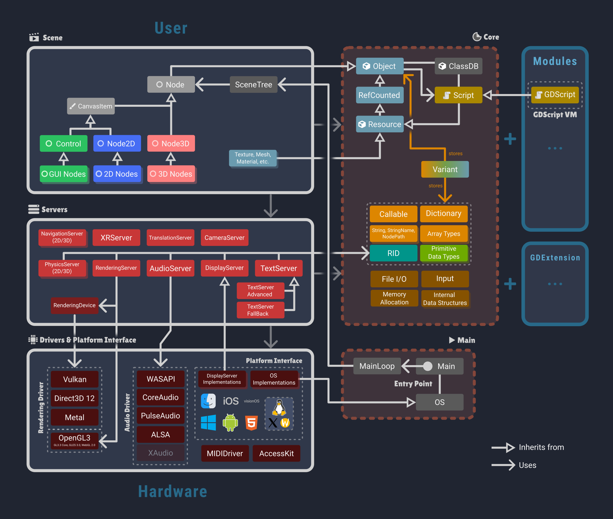

# Godot Architecture Diagram

This repository contains an architecture diagram for the Godot game engine.
It's not designed to be exhaustive, but rather a high-level overview of the main components and how they relate to each other.

## Preview

## Requirements for modifying the SVG
The SVG file has been created using [Inkscape](https://inkscape.org/), an open-source vector graphics editor. I don't know whether other SVG editors will render it correctly.

You need to install the following fonts:
- Lilita One
- Roboto

## Trademark disclaimer
All trademarks, logos and brand names used in the diagram are the property of their respective owners.
They are used for identification purposes only.
Use of these trademarks, logos and brand names does not imply endorsement.